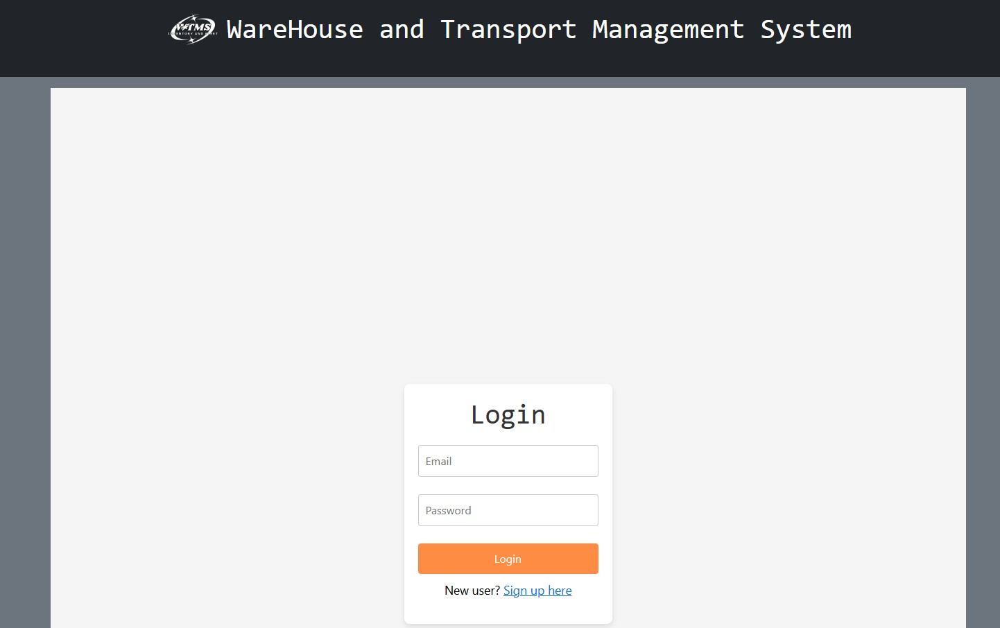
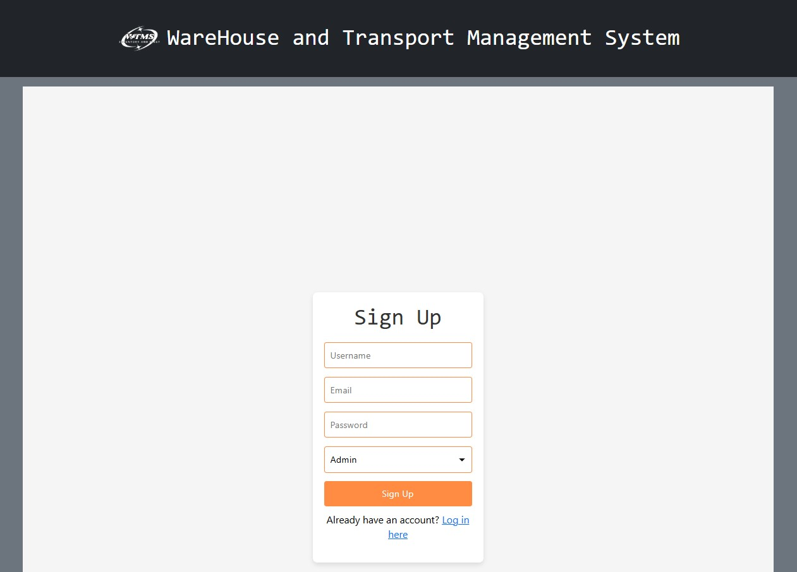
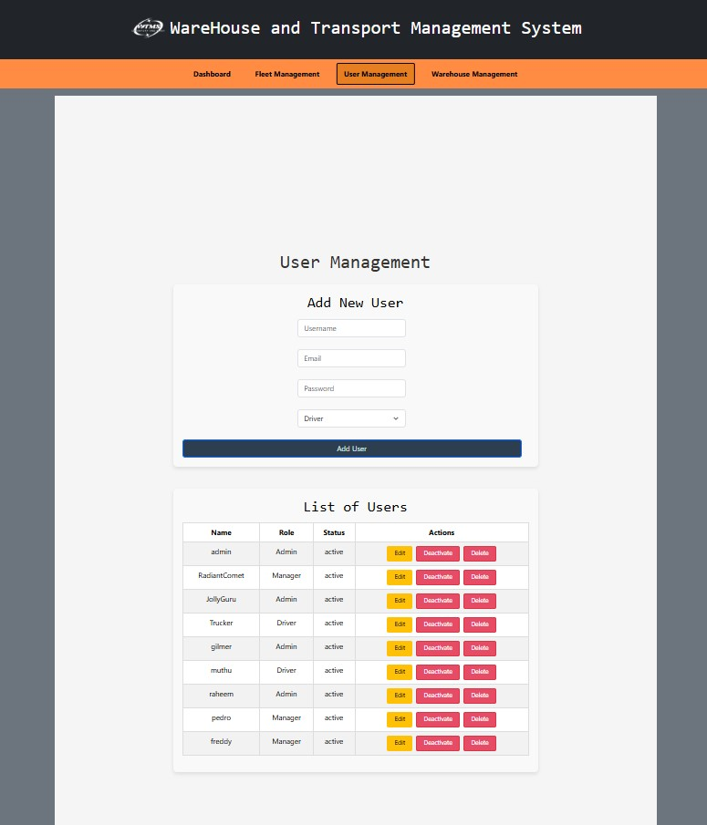
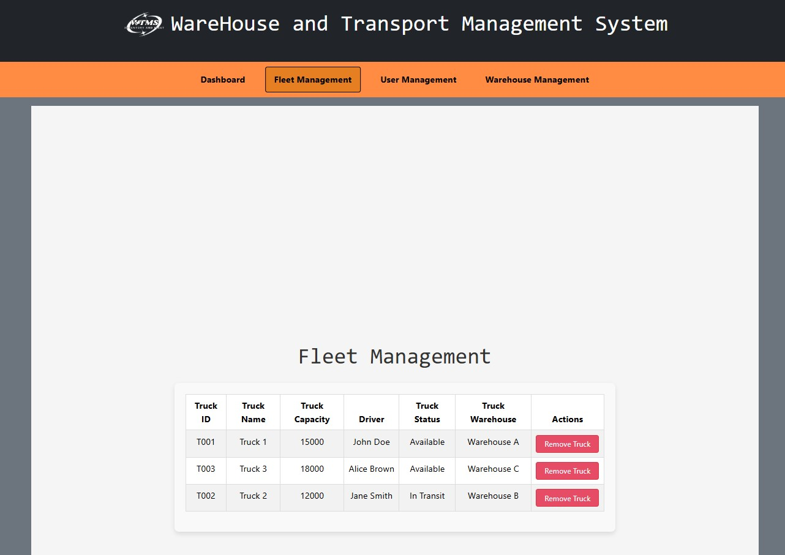
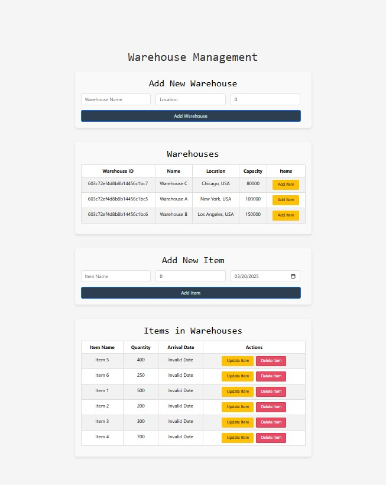

# Warehouse and Transport Management System (WTMS)

## Project Overview

The **Warehouse and Transport Management System (WTMS)** is a comprehensive web-based solution designed to streamline the management of trucks, warehouse inventory, and user authentication for logistics companies, warehouse operators, and supply chain managers. The system provides real-time tracking of transport and storage operations, ensuring efficient and secure management of resources.

### Problem Solved
Managing logistics, inventory, and transportation manually can be error-prone, time-consuming, and inefficient. WTMS addresses these challenges by offering a centralized platform for:
- Managing users and roles (Admin, Manager, Driver).
- Tracking and updating warehouse inventory levels.
- Assigning and monitoring truck deliveries.
- Providing real-time shipment status updates for customers.

### Approach
WTMS is built using a modern technology stack:
- **Frontend**: React for a dynamic and responsive user interface.
- **Backend**: Node.js with Express for server-side logic.
- **API**: GraphQL for efficient data querying and manipulation.
- **Database**: MongoDB for scalable and flexible data storage.
- **Authentication**: JWT (JSON Web Tokens) for secure user authentication.
- **Deployment**: Render for hosting the application.

The system is designed to be intuitive, scalable, and secure, ensuring smooth operations for all users.

## Table of Contents

- [Usage](#usage)
- [Mock-Up](#mock-up)
- [Instructions](#instructions)
- [Key Features](#key-features)
- [Technology Stack](#technology-stack)
- [Additional Resources](#additional-resources)

## Usage

To start the application, run the following commands:

### 1. Run the `set-up` command
```bash
npm run set-up
```

## Mock-Up

**Login Page**


**Signup Page**


**User Management Page**


**Fleet Management Page**


**Warehouse Management Page**


## Instructions

### 1. Setting up the application

Clone the repository:
```bash
git clone git@github.com:gilmerperez/wtms.git
```

Navigate to the project directory:
```bash
cd wtms
```

Install dependencies:
```bash
npm install
```

### 2. Running the application

```bash
npm run set-up
```

### 3. Using the Application

**Login or Signup**
- Use the login form to access the system.
- New users can sign up by filling out the signup form.

**User Management**
- Admins can add, edit, and deactivate users.
- View a list of all users with their roles and statuses.

**Truck Management**
- Add, edit, or remove trucks.
- Assign drivers and update delivery statuses.

**Warehouse Management**
- Add, edit, or delete warehouses.
- Track inventory levels and update item details.

## Key Features

### Feature 1: User Authentication
- Secure login and signup with JWT authentication.
- Role-based access control (Admin, Manager, Driver).

### Feature 2: User Management
- Admins can manage users, including adding, editing, and deactivating accounts.

### Feature 3: Warehouse Management
- Track and update warehouse inventory levels.
- Add, edit, or delete warehouses and items.

### Feature 4: Truck Management
- Assign drivers to trucks and monitor delivery statuses.
- Add, edit, or remove trucks.

### Feature 5: Real-Time Tracking
- Real-time updates for inventory and delivery statuses.

## Technology Stack

This project relies on the following tools and technologies:
- **Express:** Framework for building the backend API.
- **Render:** Cloud platform for deploying the application.
- **Node.js:** Backend runtime environment for server-side logic.
- **MongoDB:** NoSQL database for scalable and flexible data storage.
- **GraphQL:** Query language for efficient data retrieval and manipulation.
- **JWT (JSON Web Tokens):** Secure user authentication and authorization.
- **React:** Frontend library for building a dynamic and responsive user interface.

## Additional Resources

- React Documentation: [React Official Guide](https://react.dev/learn)
- Node.js Documentation: [Node.js Official Guide](https://nodejs.org/docs/latest/api/)
- GraphQL Documentation: [GraphQL Official Guide](https://graphql.org/learn/)
- MongoDB Documentation: [MongoDB Official Guide](https://www.mongodb.com/docs/)
